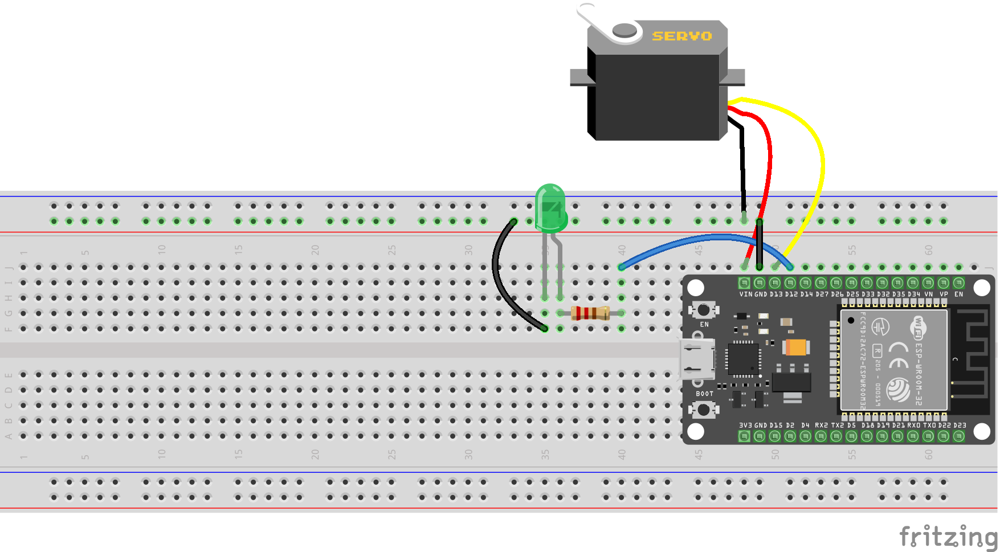

# ESP32 Bluetooth Servo Control

A simple embedded systems project for controlling an SG90 servo motor wirelessly using an ESP32 and a smartphone via Bluetooth.

## Features

- ESP32 Bluetooth communication
- Wireless servo motor control
- SG90 servo motor
- Smartphone control
- LED status indication

## Hardware

- ESP32
- SG90 Servo Motor
- LED
- Resistor
- Breadboard
- Jumper wires
- Smartphone

## Software

- Arduino IDE
- ESP32Servo Library
- Bluetooth Serial Terminal

## Circuit Diagram

## Project Demo

The project was tested using an Android smartphone connected to the ESP32 via Bluetooth.

## How It Works

The ESP32 receives commands from the smartphone through Bluetooth.
Based on the received command, the SG90 servo motor moves to the corresponding position.

## Author

**Ali Ahmadi**

GitHub: [@alialone7979](https://github.com/alialone7979)
